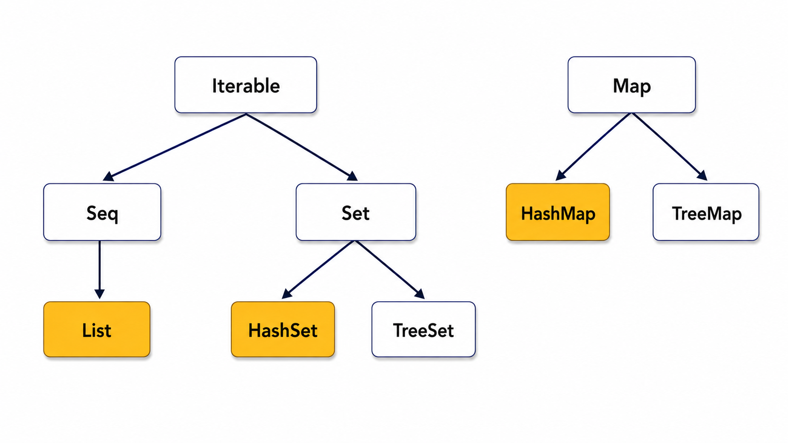

<h1 align="center">Scala & Functional Programming Interview Practice</h1>

---

---

<h2 align="center">Numbers</h2>
1. Reverse a number
2. Check palindrome number
3. Armstrong number
4. Prime number
5. Factorial
6. Fibonacci
7. Sum of digits
8. Count digits
9. GCD & LCM
10. Largest Number from a list

---
<h2 align="center">Strings</h2>
1. Reverse a string
2. Check palindrome
3. Check anagram
4. Character frequency
5. First non-repeating character
6. Remove duplicate characters
7. Reverse words in a sentence
8. Valid Parenthesis
9. String compression
10. Longest common prefix

---
<h2 align="center">Maps</h2>
1. Word frequency
2. Character frequency using Map
3. Count occurrences of elements
4. Find duplicate elements
5. First non-repeating element
6. Two Sum using Map
7. Merge two maps
8. Most frequent element
9. Group strings by first character
10. Group anagrams

---
<h2 align="center">Collection</h2>

 

- Colored Box is default implementation
- Seq is indexed, Set is unique and Map is key-value. (Tree* - is sorted)
- Everything above is Immutable, Scala also has mutable collections. (scala.collection.mutable._)
- Scala collections are designed for transformation, Instead of changing the original collection, you create a new one.

### Common method for all collection, because it is defined in Iterable, also apply for Map

| Category  | Methods                                     |
|-----------|---------------------------------------------|
| Iterate   | `foreach`                                   |
| Transform | `map`, `flatMap`, `collect`                 |
| Filter    | `filter`, `filterNot`, `partition`          |
| Search    | `find`, `exists`, `forall`                  |
| Aggregate | `fold`,`foldRight`, `reduce`, `reduceRight` |
| Group     | `groupBy`, `groupMap`                       |
| Info      | `size`, `isEmpty`, `nonEmpty`, `min`, `max` |

---
1. **List:** A List is an ordered, linear sequence implemented as a singly linked list.
   - **Slicing** → `take`, `drop`, `slice`, `splitAt`, `span`
   - **Combination** → `zip`, `unzip`, `zipwithIndex`
2. **Set:** A Set is a collection of unique elements that is optimized for fast membership testing.
   - **Duplicate Insertion** → If duplicate is inserting, it will update previous (No Impact) 
   - **Set Operations** → `union`, `intersect`, `diff`, `subsetof`
3. **Map:** A Map is a collection of key-value pairs, keys in a map are always unique.
   - **Inspection** →  `keys`, `keySet`, `values`

- **Sorted Variant:** TreeList doesn't exist, use SortedSet or SortedMap for sorted behavior.
- **Null Handling:** Sets and Maps cannot contain null keys (Sets can't contain null at all).
---

### Complete Methods Summary

| Category     | **List**                                              | **Set**                                                  | **Map**                                                                     |
|--------------|-------------------------------------------------------|----------------------------------------------------------|-----------------------------------------------------------------------------|
| **Creating** | `List()`, `Nil`, `List.from`                          | `Set()`, `Set.from`                                      | `Map()`, `Map.empty`, `Map.from`                                            |
| **Adding**   | `::`, `+:`, `:+`, `patch`, `:::` (merge)              | `+` (add single), `++` (merge)                           | `+` (add single), `++` (merge)                                              |
| **Updating** | `updated(index, value)`                               | No method                                                | `+`, `++`                                                                   |
| **Reading**  | `apply(index)`, `lift(index)`, `head`, `last`, `tail` | `apply(element)` ✗ (throws error), `contains(element)` ✓ | `apply(key)` (throws error), `get(key)` (Option), `getOrElse(key, default)` |
| **Deleting** | `drop(n)`                                             | `-` (remove single), `--` (remove multiple)              | `-` (remove key), `--` (remove multiple keys)                               |